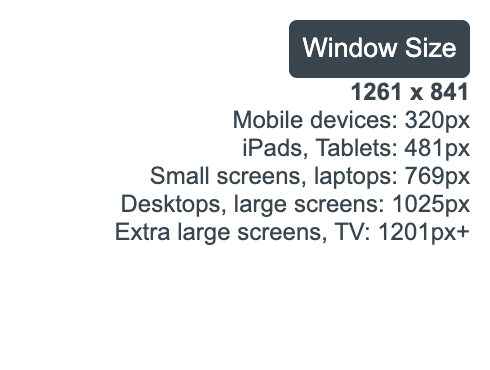

# Problem Statement : One of the problem of working on responsive layout is to get the window size.
This extension aims to solve just that. By cliking on window size, a user can know the exact size of the window, 
s[he] is working in. It also provides the common break points so you need not to remember that.
This is still version 1. Here are some of the things that I will update in next version of the project.

